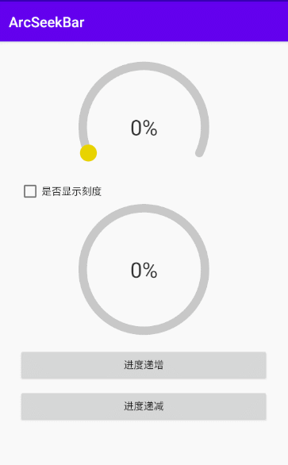

# ArcSeekBar

[](https://raw.githubusercontent.com/jenly1314/ArcSeekBar/master/app/release/app-release.apk)
[](https://bintray.com/beta/#/jenly/maven/arcseekbar)
[](https://repo1.maven.org/maven2/com/github/jenly1314/arcseekbar)
[](https://jitpack.io/#jenly1314/ArcSeekBar)
[](https://travis-ci.org/jenly1314/ArcSeekBar)
[](https://circleci.com/gh/jenly1314/ArcSeekBar)
[](https://android-arsenal.com/api?level=16)
[](https://opensource.org/licenses/mit-license.php)
[](https://jenly1314.github.io/)
[](http://shang.qq.com/wpa/qunwpa?idkey=8fcc6a2f88552ea44b1411582c94fd124f7bb3ec227e2a400dbbfaad3dc2f5ad)

ArcSeekBar for Android 是一个弧形的拖动条进度控件，配置参数完全可定制化。

**ArcSeekBar** 是基于 [CircleProgressView](https://github.com/jenly1314/CircleProgressView) 修改而来的库。
但青出于蓝而胜于蓝，所以 [CircleProgressView](https://github.com/jenly1314/CircleProgressView) 的大部分用法，**ArcSeekBar**基本都支持，而且可配置的参数更细致。

之所以新造一个ArcSeekBar库，而不直接在**CircleProgressView**上面直接改，原因是**CircleProgressView**里面的部分动画效果对于**SeekBar**并不适用，所以**ArcSeekBar**是在**CircleProgressView**的基础上有所删减后，而再进行扩展增强的。
实际还需根据具体的需求而选择适合的。

## Gif 展示



## ArcSeekBar自定义属性说明（进度默认渐变色）
| 属性 | 值类型 | 默认值 | 说明 |
| :------| :------ | :------ | :------ |
| arcStrokeWidth | dimension |12dp| 画笔描边的宽度 |
| arcStrokeCap | enum | ROUND | 画笔的线冒样式 |
| arcNormalColor | color |<font color=#C8C8C8>#FFC8C8C8</font>| 弧形正常颜色 |
| arcProgressColor | color |<font color=#4FEAAC>#FF4FEAAC</font>| 弧形进度颜色 |
| arcStartAngle | integer | 270 | 开始角度，默认十二点钟方向 |
| arcSweepAngle | integer | 360 | 扫描角度范围 |
| arcMax | integer | 100 | 进度最大值 |
| arcProgress | integer | 0 | 当前进度 |
| arcDuration | integer | 500 | 动画时长 |
| arcLabelText | string |  | 中间的标签文本，默认自动显示百分比 |
| arcLabelTextColor | color |<font color=#333333>#FF333333</font>| 文本字体颜色 |
| arcLabelTextSize | dimension |30sp| 文本字体大小 |
| arcLabelPaddingTop | dimension |0dp| 文本居顶边内间距 |
| arcLabelPaddingBottom | dimension |0dp| 文本居底边内间距 |
| arcLabelPaddingLeft | dimension |0dp| 文本居左边内间距 |
| arcLabelPaddingRight | dimension |0dp| 文本居右边内间距 |
| arcShowLabel | boolean | true | 是否显示文本 |
| arcShowTick | boolean | true | 是否显示环刻度 |
| arcTickStrokeWidth | dimension |10dp| 刻度描边宽度 |
| arcTickPadding | dimension | 2dp | 环刻度与环间距 |
| arcTickSplitAngle | integer | 5 | 刻度间隔的角度大小 |
| arcBlockAngle | integer | 1 | 刻度的角度大小 |
| arcTickOffsetAngle | integer | 0 | 刻度偏移的角度大小 |
| arcThumbStrokeWidth | dimension |8dp| 拖动按钮描边宽度 |
| arcThumbColor | color |<font color=#E8D30F>#FFE8D30F</font>| 拖动按钮颜色 |
| arcThumbRadius | dimension |10dp| 拖动按钮半径 |
| arcThumbRadiusEnlarges | dimension |8dp| 触摸时按钮半径放大量 |
| arcShowThumb | boolean | true | 是否显示拖动按钮 |
| arcAllowableOffsets | dimension |10dp| 触摸时可偏移距离：偏移量越大，触摸精度越小 |
| arcEnabledDrag | boolean | true | 是否启用通过拖动改变进度 |
| arcEnabledSingle | boolean | true | 是否启用通过点击改变进度 |

## 引入

### Gradle:

1. 在Project的 **build.gradle** 里面添加远程仓库  
          
```gradle
allprojects {
    repositories {
        //...
        mavenCentral()
    }
}
```

2. 在Module的 **build.gradle** 里面添加引入依赖项
```gradle
implementation 'com.github.jenly1314:arcseekbar:1.0.3'

```


以前发布至JCenter的版本
```gradle
implementation 'com.king.view:arcseekbar:1.0.2'
```


## 示例

布局示例
```Xml
    <com.king.view.arcseekbar.ArcSeekBar
        android:id="@+id/arcSeekBar"
        android:layout_width="wrap_content"
        android:layout_height="wrap_content"/>
```

代码示例
```Java
    //进度改变监听
    arcSeekBar.setOnChangeListener(listener);
    //设置进度
    arcSeekBar.setProgress(progress);
    //显示进度动画（进度，动画时长）
    arcSeekBar.showAnimation(80,3000);

```

更多使用详情，请查看[app](app)中的源码使用示例

## 版本记录

#### v1.0.3：2021-9-1 (从v1.0.3开始发布至 MavenCentral)
*  对外暴露更多getter和setter方法
*  新增arcTickOffsetAngle属性

#### v1.0.2：2020-12-2
*  优化设置渐变色过程处理

#### v1.0.1：2020-9-16
*  优化细节

#### v1.0.0：2020-3-28
*  ArcSeekBar初始版本

## 赞赏
如果您喜欢ArcSeekBar，或感觉ArcSeekBar帮助到了您，可以点右上角“Star”支持一下，您的支持就是我的动力，谢谢 :smiley:<p>
您也可以扫描下面的二维码，请作者喝杯咖啡 :coffee:
    <div>
        
        
        
        
    </div>

## 关于我
   Name: <a title="关于作者" href="https://about.me/jenly1314" target="_blank">Jenly</a>

   Email: <a title="欢迎邮件与我交流" href="mailto:jenly1314@gmail.com" target="_blank">jenly1314#gmail.com</a> / <a title="给我发邮件" href="mailto:jenly1314@vip.qq.com" target="_blank">jenly1314#vip.qq.com</a>

   CSDN: <a title="CSDN博客" href="http://blog.csdn.net/jenly121" target="_blank">jenly121</a>

   CNBlogs: <a title="博客园" href="https://www.cnblogs.com/jenly" target="_blank">jenly</a>

   GitHub: <a title="GitHub开源项目" href="https://github.com/jenly1314" target="_blank">jenly1314</a>

   Gitee: <a title="Gitee开源项目" href="https://gitee.com/jenly1314" target="_blank">jenly1314</a>

   加入QQ群: <a title="点击加入QQ群" href="http://shang.qq.com/wpa/qunwpa?idkey=8fcc6a2f88552ea44b1411582c94fd124f7bb3ec227e2a400dbbfaad3dc2f5ad" target="_blank">20867961</a>
   <div>
       
       
   </div>

